# Diamond Cutter Translation Tool — daily digest, Tuesday 9 September 2026 (covers everything since Monday's 13:40 digest)

**Headline.** The picture below is the one I would most like you to look at: two prints of the same passage, with the words that differ marked where they differ. Since Monday's digest the tool gained a complete
**Compare & Merge suite** for Tibetan texts, and then the first working
tools built on top of it: every save of a text is now kept and restorable,
a corrector's changes can be applied and checked hunk by hunk, one
systematic correction can be made across a whole folder with every
occurrence previewed first, and the differences between two drafts can be
sent to Geshe Michael as a Word document with real revision marks. The
menu bar reached parity with Microsoft Word and Sublime Text, twelve menus
and a Word-style Preferences window.

Two things came in today at your request. There is now an **idiom
register** with a bank to work from: it marks which Tibetan forms are fixed
expressions, shows how Geshe Michael has rendered them in his own courses,
and takes new ones through him for a ruling. And a **Features** page lets
anyone turn off the parts of the tool they do not use, so the window
carries only their own work.

Everything ran green: 113 automated suites, 313 checks in the text engines
and 712 in the app's own self-test. The build is pressed, signed and
installed.

## The one I am most pleased with: two prints, side by side

Look at line four. The Sera Mey print reads **THAMS CAD**; the Ganden print reads **KUN**. Both words mean "all", so the sense is untouched — and that is exactly the kind of variant that is nearly invisible when you read two editions one after the other, and unmissable when the tool marks it. Two more differences follow: a line that stands only in the Sera Mey print, and a line that stands only in the Ganden.

I should be exact about what this picture is. It is a demonstration: one passage, two copies, three differences put there on purpose, with the two prints' names as labels. We have not yet collated the actual Sera Mey and Ganden editions. What the picture shows truthfully is the machinery, which is finished and tested — the marking at the level of the word, the count of every difference in the text, and the ability to carry a reading from one side to the other and save the result.

Where I think this earns its place is textual study. Every ACIP text we hold was typed from a particular print, and our collections come from different monasteries, different regions and different periods. Until now, telling two of them apart meant reading them side by side and trusting your eye over hours. This does it in a moment, and it does it at the level of the word rather than the line, so a variant of one syllable in a long passage cannot slip past. It will compare a whole folder of one collection against another in the same way, and it cites every variant it finds by folio and line, which is the form an apparatus needs.

It should serve the input centres just as directly. When the same text has been typed twice, or corrected and returned, the differences between the two files are the work — and the differences are now a list rather than a hunt.

## What I did

- **Menus, complete.** I modelled the menu bar on Word and Sublime Text,
  taking each of their menus in turn and keeping what has an honest use on
  a Tibetan text file: File, Edit, Selection, Find, Insert, Format, Tools,
  Project, Goto, View, Window and Help. Highlights: a Properties window
  whose Statistics understand folios, syllables and shads; encodings for
  legacy input-centre files chosen on open and on save; Paste Special
  converting between ACIP, Wylie and Tibetan script; Find and Replace with
  regular expressions, preserved capitalisation and find-in-files; Goto a
  heading, a line, a folio, a dictionary entry or the concordance;
  bookmarks in the margin; Insert a folio marker, a Tibetan-symbol palette,
  the date with the Tibetan year; Format styles and case changes including
  Tibetan transliteration; Tools for spelling doubts, phrase memory,
  hand-offs to the Draft and Manuscript, document protection, snippets;
  a Project menu built on dossiers; a Window menu; Help ▸ Data Status.
  Items with no meaning here (multi-caret editing, page layout, mail
  merge, build systems) were skipped and the reasons recorded.

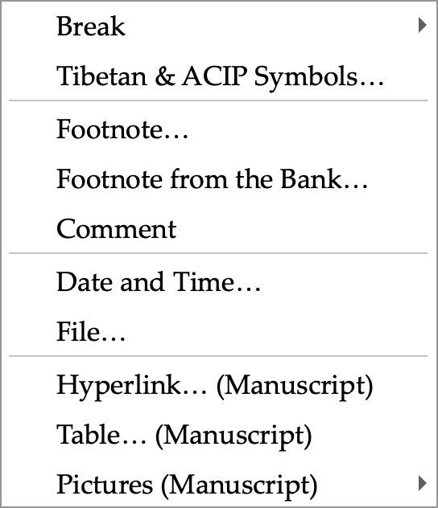

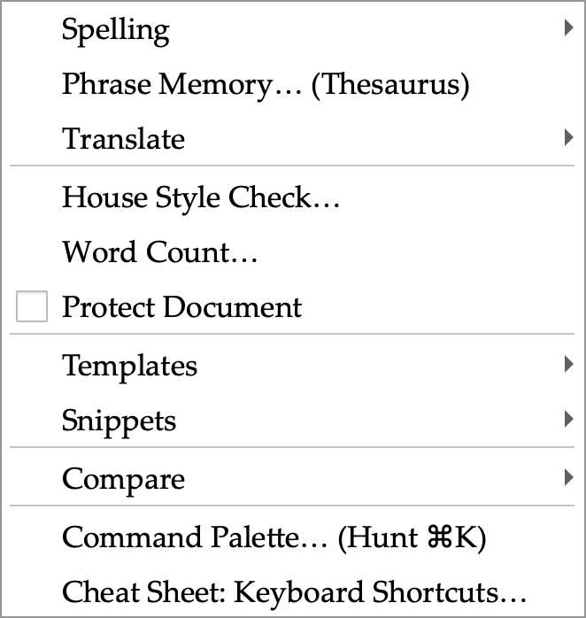

- **Preferences.** A Word-style window of eleven pages behind an icon
  grid with search: General, View, House Style, Lookup, Compare, Team,
  Locations, Privacy, Colours, Shortcuts and Quick Access. Every switch
  drives a real setting; the Shortcuts page lists every menu command and
  key from the live menu bar.

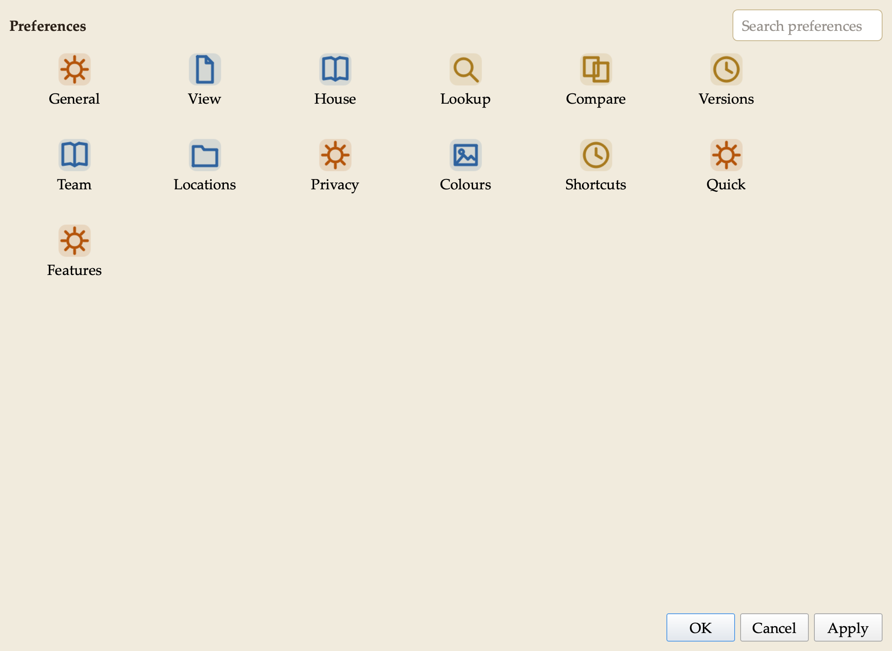

- **House style.** I made our style sheet's spacing rules switches on the
  House Style page: two spaces after a sentence, applied on demand, on
  save, or as you type — English only, abbreviations left alone. Colon and
  semicolon rules are there too, off until I confirm them against the
  sheet.

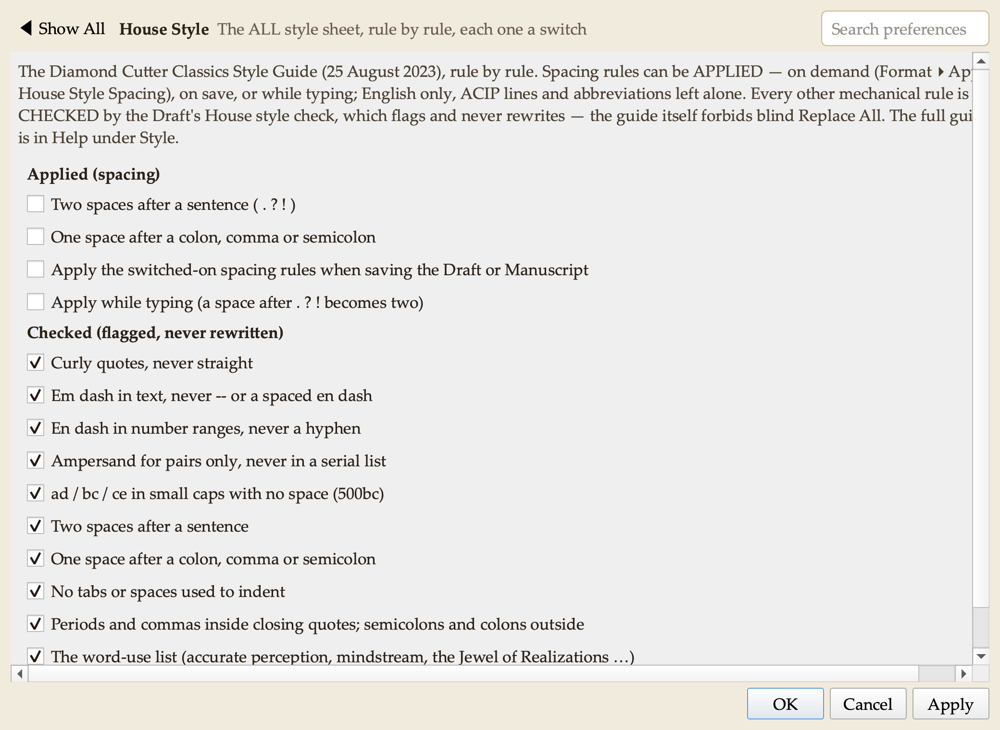

- **Compare & Merge suite.** I studied Beyond Compare, WinMerge,
  UltraCompare and Araxis Merge and built their combined functionality
  into a new Compare pane in the Research group, adapted for our texts.
  Compare two files, or a text against the clipboard or its saved version;
  differences are shown line by line with the changed **syllables**
  highlighted, in any of ACIP, Wylie or Tibetan script. Rules let the tool
  ignore spacing, shad variants, folio markers, editorial brackets, or
  compare **across scripts** (an ACIP file against a Unicode file). Copy a
  reading left or right, undo without limit, edit in place, pin lines that
  must align. Reports: a side-by-side HTML page, a patch file, and an
  **apparatus criticus** in Markdown or CSV. Folder Compare classifies two
  folders and copies only after a preview (it never deletes); snapshots
  record a folder's state for later comparison. Three-Way Merge combines
  two edited copies of one text against the original, resolving conflicts
  one by one; a file left with conflict markers opens as a two-sided
  comparison. Command-line comparison for scripted checks.

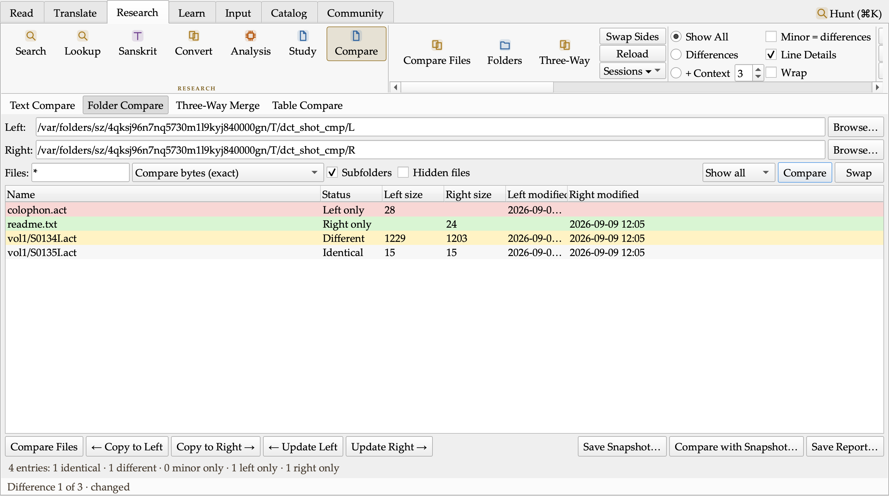

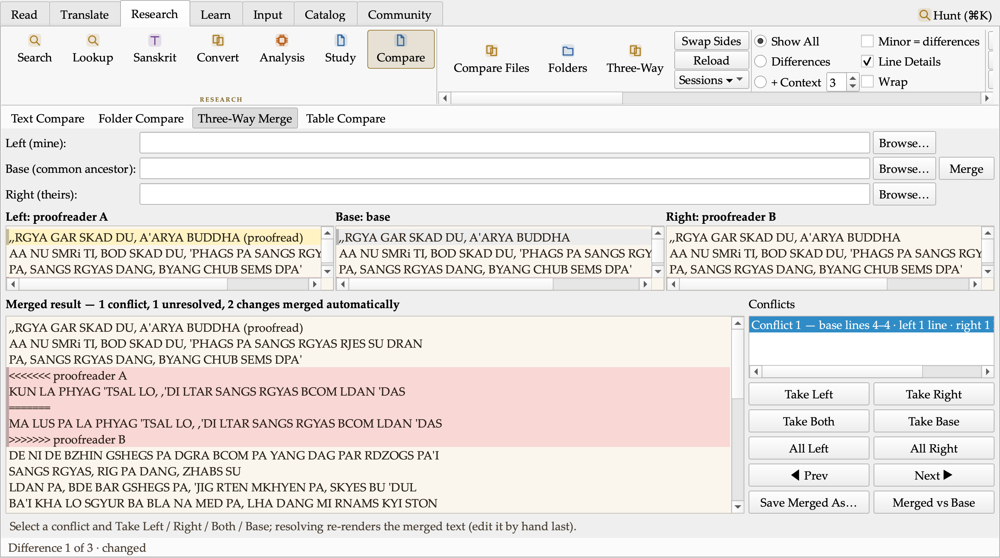

- **Dictionary ordering.** Aligned renderings now rank most-attested
  first with counts (THAMS CAD: all ×30, every ×14, each and every ×10).
- **Research written up.** I surveyed sixteen text-analysis tool families
  (diff and merge tools, Word and Acrobat document compare, Draftable,
  folder sync, version control, find-and-replace suites, near-duplicate
  detection, TRACER text reuse, Voyant statistics, change tracking, patch
  tools, structured-data compare) and **EndNote** and Zotero as models for
  an in-house reference bank. Each feature has a verdict and a Tibetan-
  translation use; three follow-on batches are planned: document Versions,
  Replace in Files with preview, Apply Patch; Repeated Passages and
  similarity studies, a Statistics study view, Entities in a text, table
  compare; and a References pane with Insert Citation. Design work on all
  three began the same evening, alongside a study of the monastery and
  holy-site maps I collected, toward a Map pane in the Research group.
- **Small things.** A dharma-wheel busy cursor while the tool works. Two
  defects found by the battery were fixed the same hour (a false "corrupt
  image" verdict in packaging; a shutdown crash in a status-bar hook).

### The analysis suite, batch 4 — the editing tools the compare engine made possible

With the compare engine in place I built the first batch of the analysis suite in the order the plan's critic set, one feature at a time, each with its own test battery before I moved to the next.

**Versions.** Every save of a document, draft or manuscript now keeps a compressed copy with who saved it, when, in which encoding, the revision number and the text statistics of that moment. File ▸ Versions… lists them; a version can be compared with what I am editing or with another version, restored (the text on disk is kept first, even if another program changed it), named and pinned so it is never pruned, or asked which version first introduced a given line. Damaged records are shown red and excluded. Preferences ▸ Versions holds the switch, the caps and the rolling autosave slot. Renaming a file carries its history with it.

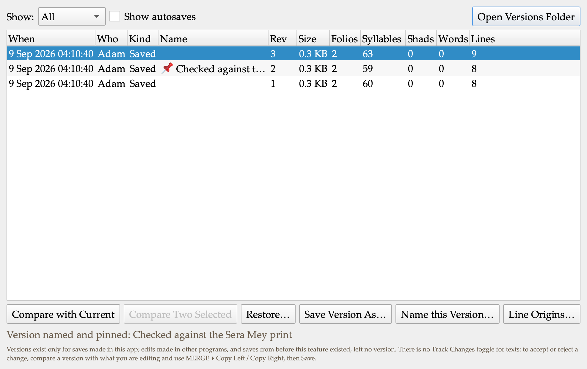

**Changed-folios report.** "7 of 143 folios changed": the apparatus grouped by the left text's folio markers, as a Markdown table with the readings under each folio, or as CSV. It is a Save Report filter, a Copy Changed Folios action, a fragment on the Compare status line, and a command-line output. The header states every grouping rule, so a reader can reproduce it.

**Normalize.** The compare rules offered as transformations: collapse spacing, trailing blanks, blank-line runs, the double-shad spelling, spacing around the shad, apparatus spans, folio markers, line endings, a final line break, house-style spacing. Every run previews as a diff in the Compare pane, lists the lines the rules refused and why, and only then applies — the Apply button is dead until a preview exists for exactly these settings and this text. The double-shad form has no default: that is the house's ruling to make, not mine.

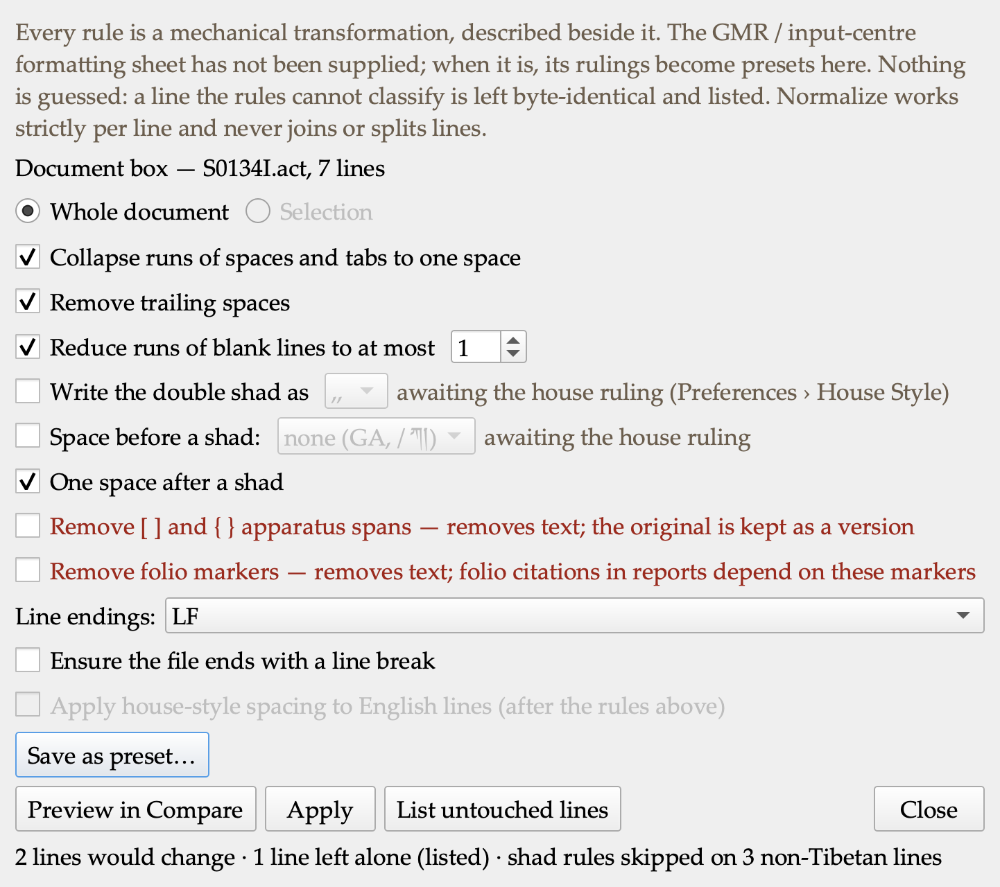

**Replace in Files.** One systematic fix across a whole folder, every occurrence listed with its line before and after, tick or untick, then a two-step apply to the ticked files only. Every skipped file is named with its reason (binary, not UTF-8, over the size cap, past the file cap, open with unsaved edits, changed since the preview, a library text without permission). A search text in the wrong script gets a notice, so a count of zero never reads as a clean bill of health. Each run leaves a changeset record and an undo that restores the files from their pre-replace versions and skips any file edited since. Counts come from the files themselves, never from the search index — the footer says so.

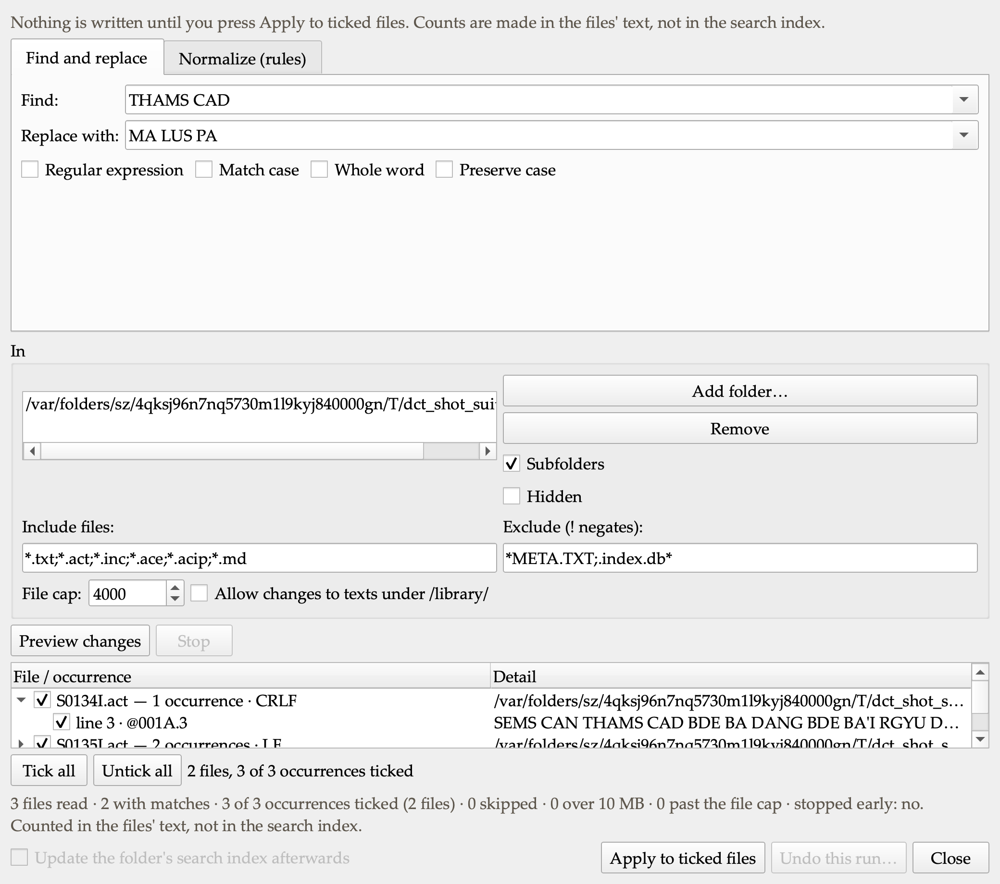

**Apply Patch** (in progress at the time of this draft). A corrector's unified diff loaded against my copy: each hunk placed exactly, with an offset, with loosened context, already applied, or rejected — five distinct verdicts, never folded into one. The result is a diff in the Compare pane, the rejected hunks go to a .rej file for the corrector, and the previous text is kept as a version before anything is written.

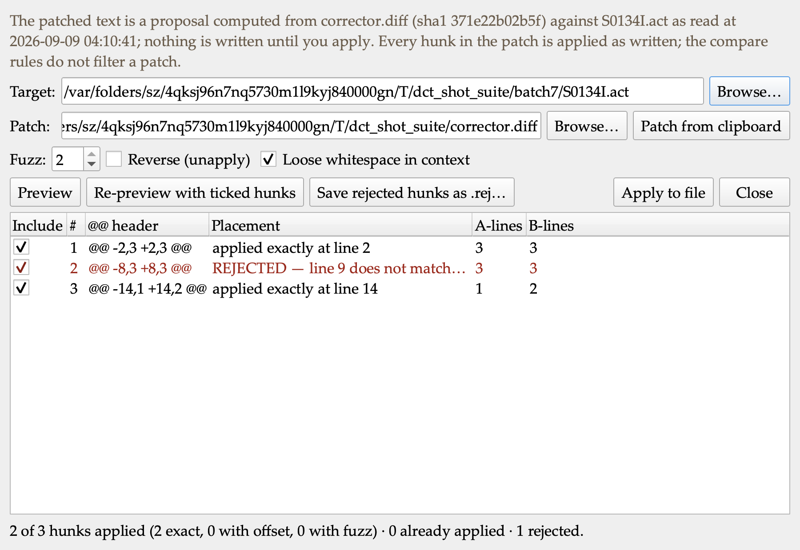

**Tracked changes for Word** (engine in progress). The differences between two drafts written as a Word document with real revision marks, so Geshe Michael can accept or reject each change in Word itself. The first paragraph says what the file compares, under what rules, who ran it, and that the marks are machine-computed. I will not add it to the Save Report menu until I have opened a sample in Word and recorded that Accept All gives text B and Reject All gives text A.

### Release audit: eleven of twelve open items closed

The pane-by-pane release audit had left twelve items on the main window needing a ruling. I closed eleven today: the one headless probe that ran outside the safety guard now runs inside it; a dead window-size call is gone; the Sanskrit glyph check, which used to run only by hand, is a test gate (109 suites now); a Quick Access pin whose command was renamed shows as "not in this build" instead of vanishing; the lifecycle log rotates at one megabyte; clearing the scan cache or the search index takes a second, sized click; the Edit menu shows the standard shortcuts the Help advertises; the menu that mirrors every pane's buttons now skips the destructive ones. Three were verifications, not changes: the press never uses the reduced-battery escape hatch, the data-import hook is wired in every build, and the installed build's data is release 0.27.2 (105,634 entries, 42,199 corpus segments), read from the database itself. The twelfth — whether both diagnostic reports, with their different privacy profiles, should ship — is a ruling I need from leadership.

### Pressed and running

The whole batch is pressed, signed, verified and installed on my desktop (dev-ca74251, then a second press with the audit sweep). Every press ran the full battery, the constitution check and the visual-regression gate over the blessed panes before it was allowed to install.

### The idiom register, and a bank to work from

Idioms are the one thing a word-by-word reading gets exactly wrong, and Geshe Michael uses them constantly. We started a register of them in August; nothing read it until today. Now the tool does.

The register marks **which** Tibetan forms are idioms. It holds no English of its own, and that is deliberate: the English is Geshe Michael's. The renderings shown beside a form are his, fetched from his own courses and counted, in their own contexts. My English exists in exactly one place, as the payload of a proposal that is waiting for his ruling, and it is labelled as mine everywhere it appears.

Every form carries its status. Approved means he ruled it an idiom. Awaiting his ruling means exactly that, and the tool says so rather than implying the matter is settled. Ruled not an idiom is kept as a record, and the tool stops marking that form, so the same question does not come back a third time.

Proposing one takes a moment: select the Tibetan while translating, right-click, and the form goes into the shared proposals folder with the passage as evidence and my name on it. When he rules, one button brings his approvals and declines into the team register with his name and the date. The five forms in the register today are the ones the corpus calibration put forward in August, and all five are still waiting for him.

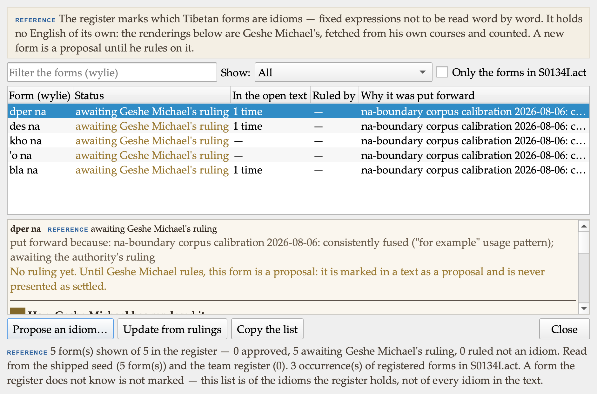

### Turning off what you do not use

The suite now carries twenty-six panes in seven groups. Someone who only reads and drafts meets twenty surfaces they will never open. So Preferences now has a Features page: every pane and every group is a switch.

Above those switches sits a row of workflows — translating, editing, reading and study, cataloguing, input and proofreading, learning Tibetan. Tick the ways you work, and the tool turns on what they need between them; tick two and you get both. They are a fast way to set the switches, not a lock: everything below stays yours to change afterwards, and the page says so. I want to be plain that the six are coarse first guesses at how people work. The session with our editor and the one-on-ones with the translators are exactly where they will be corrected.

Hiding is a view, not a removal. Nothing is deleted, the feature keeps working, its files are untouched, and it stays reachable from the menus, so something used twice a year can still be used twice a year without being switched back on. The list is built from the panes that actually exist when the app runs, so it can never drift from the build. Turning everything off is refused: a window with nothing in it is a fault, not a preference.

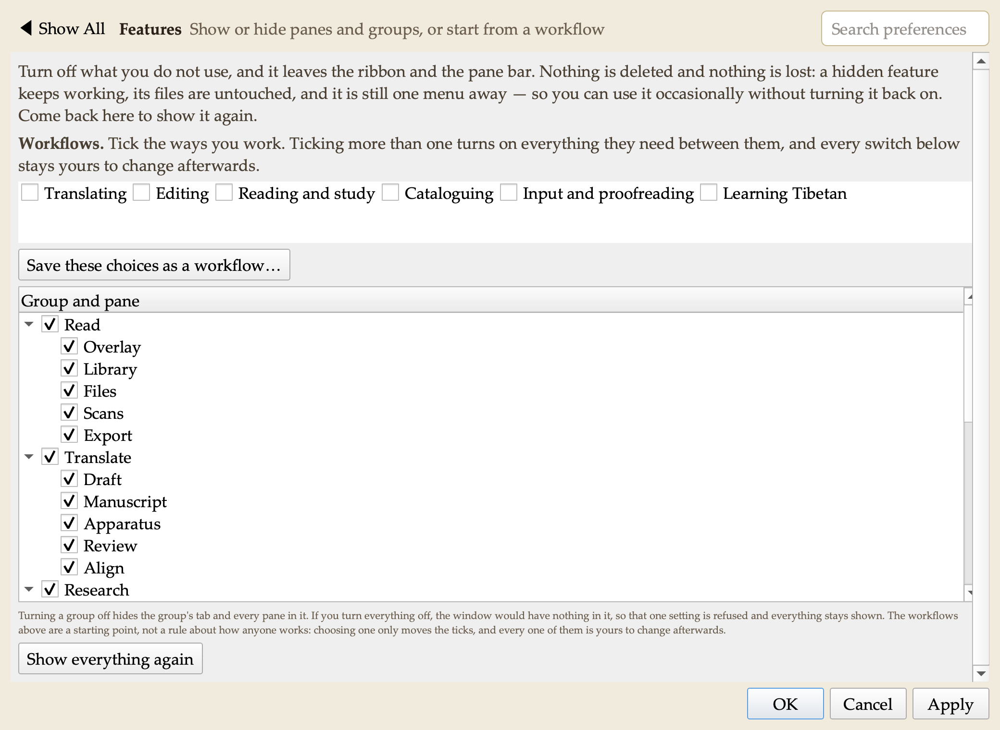

### The next batch of the analysis suite: the foundation, and a first result

The plan's critic set an order for the second analysis batch, and it begins with work nobody sees. The program had four separate ways of walking folio numbers and its own private syllable splitter buried in one file. Adding a fifth of each was the hazard three of the subsystem maps had already named. Those are now one shared piece of machinery, and the proof that the move was faithful is that the old test batteries passed unchanged.

On top of it, two visible things. **Study** is a new pane in Research with four pages, each of which will answer a question about a text: what it counts, what it repeats, which other texts share material with it, and which people, works and dates it names. The pages arrive with their engines over the next stretch; today each one states plainly what it will do and that its engine is not in this build, so no number on the screen is a placeholder.

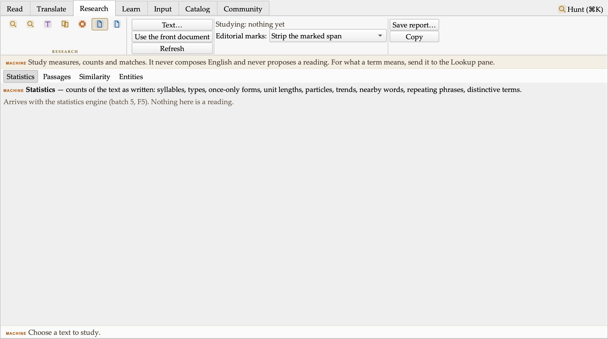

**Table Compare** is finished and working now, as a fourth page of the Compare pane. It answers a question the text comparison cannot: when a new dictionary release arrives, which headwords actually changed? Not a sixty-megabyte text difference, but a list of records paired by a key I choose. It refuses to guess: when the same headword appears twice on a side, it says so and never pairs them by position. Run against the real release file, 105,634 rows, it found exactly the 56 duplicated headwords we already knew were there.

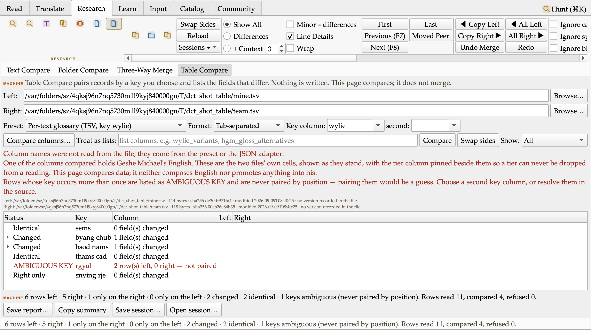

## Decisions I made along the way

- The style sheet's rules live as switches in Preferences, so any of them
  can be turned on or off.
- Cover notes for these digests and for technical documents recommend
  opening the **.docx**, which is properly formatted, over the .md and .txt.
- Every digest now carries screenshots of what changed and a chart where
  it explains the numbers, captured by the tool itself so they are
  reproducible.
- New features may get their own tabs, groups or panes wherever that reads
  most logically, rather than being crammed into existing ones.
- The desktop build will be re-pressed once the menu work is complete, not
  after every batch.
- Filed for after the release: a Textual Research workflow (collections,
  word and variant studies), companion iOS/Android reader apps, Tibetan
  Buddhist iconography in the interface, and a list of research-suite
  questions to put to Geshe Michael.
- Versions are deduplicated by content: saving an unchanged text keeps
  nothing new and says so, and restoring a version does not re-bank a
  copy that is already kept. Identical bytes are one version.
- The double-shad spelling and the space before a shad have no default in
  Normalize. Shipping a wrong default would silently re-spell every shad
  in a volume; the house ruling decides.
- Replace in Files refuses to run when Versions are switched off: without
  the pre-replace copies there would be no undo, and a batch rewrite
  without an undo is not something I will offer.
- A search text in one script against files in another gets a notice
  instead of a zero. A zero must never read as "the text is clean".
- The idiom register holds no English of its own. English is Geshe Michael's; the tool shows his renderings from his own courses and labels a translator's proposed English as the translator's until he rules.
- Workflows can be combined rather than chosen between. Someone who both translates and edits ticks both and gets what either needs, and every switch stays theirs afterwards. The six shipped ones are coarse first guesses; the role sessions will correct them.
- Hiding a feature is a view, not a removal: a hidden pane stays reachable from the menus, so occasional use does not mean switching it back on.
- The idiom bank did not get a ribbon button. It would have pushed the widest ribbon eighty pixels past the width limit we set ourselves, so the feature moved to the right-click menu instead of the limit moving.
- The Word redline ships command-line first. The menu filter appears only
  after I have opened a sample in Word and recorded that Accept All gives
  text B and Reject All gives text A. No dead control in the meantime.

## Numbers

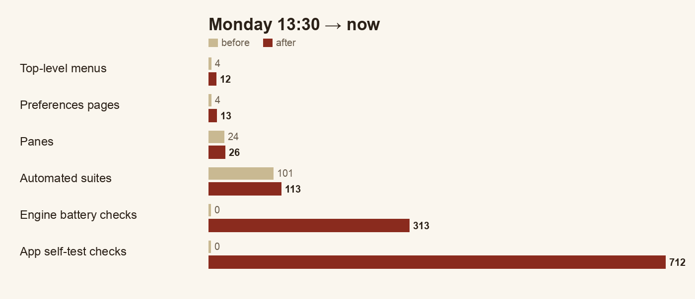

| | Monday 13:30 | Now |
|---|---|---|
| Top-level menus | 4 | 12 |
| Preferences pages | 4 groups in one dialog | 13 pages |
| Panes | 24 | 26 (Compare, Study) |
| Automated suites | 101, all green | 113, all green |
| Checks in the text engines | — | 313 across 11 batteries |
| Checks in the app's own self-test | — | 712 |
| Analysis-suite features shipped | 0 | 6 of the first batch, plus the foundation and Table Compare of the second |
| Headwords whose renderings were out of frequency order | 763 | 0 |

## Open questions for leadership

1. Licence for the project's own code (unchanged; blocks a public release).
2. Whether the repository moves to the ALL organisation on GitHub.
3. Apple Developer ID for a notarised install.
4. The 24 data layers with open terms.
5. **New:** confirmation of the style sheet's colon and semicolon spacing
   rules, so I can set the defaults.
6. **New:** I will ask Geshe Michael what he wants from the research suite
   before it is designed in detail.
7. **New:** the house convention for the double shad (`,,` or `, ,` in
   ACIP; `།།` or `༎` in Tibetan script) and the space before a shad — until
   ruled, Normalize leaves both alone.
8. **New:** whether canonical library texts may be rewritten in bulk by
   Replace in Files (today: only with an explicit switch, and every such
   file is badged and counted).
9. **New:** should a hidden feature also disappear from the menus, or stay
   reachable there as it does now?
10. **New:** the six workflows are my first guess at how people work. The
   editor's session and the translators' one-on-ones should correct them,
   and anyone can tell me now if one of the six is wrong.
11. **New:** the five idioms in the register are all waiting on Geshe
   Michael. A short sitting with him would settle them and show the group
   how the channel works.
12. **New:** a Word verification of the tracked-changes export — ten minutes
   with a sample in Microsoft Word — before it appears in the menus.

## Next

Build out the Study pane's four engines in the critic's order; press a
fresh build with the whole batch and relaunch it on the desktop; clear the
twelve release-audit items that still need a ruling; then the Map pane
study and the second analysis batch (repeated passages, collation of many
witnesses, the citation and reference bank).
