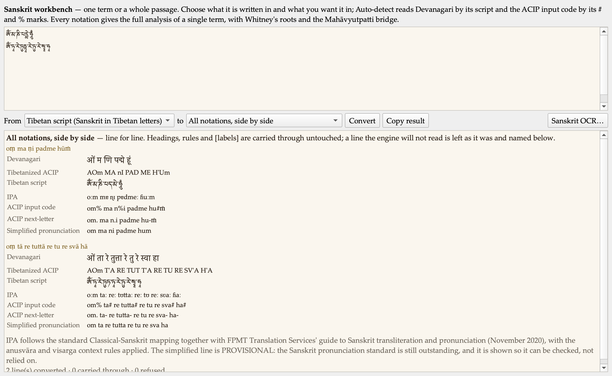
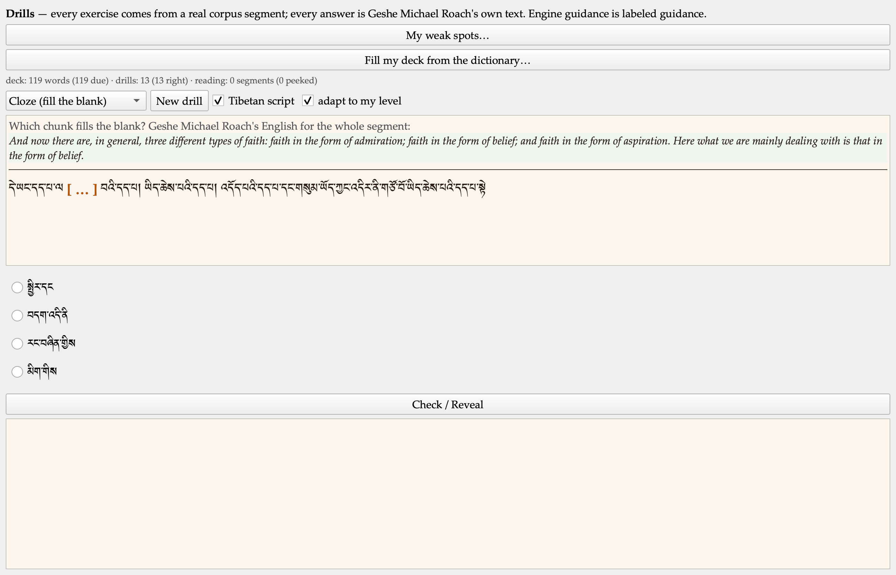
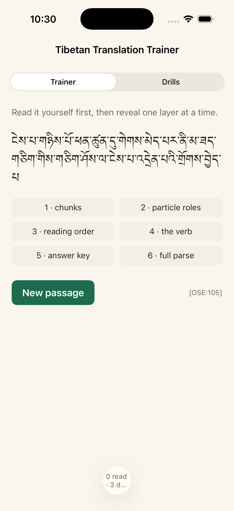

# Diamond Cutter Translation Tool — daily digest, Thursday 10 September 2026

**Headline.** Almost everything below came from using the tool rather than from planning to build it. I hovered over a button and nothing appeared; I opened a pane and could not find the way in; I pasted a verse and it refused the whole thing over a character I could not see; I ran a drill and the English was five times longer than the Tibetan. Each one turned out to have a cause worth finding, and several of them were hiding something larger than the symptom.

Two things also arrived that I have wanted for a while. The Sanskrit workbench now reads a mantra written in Tibetan letters and gives back how to say it — which is the everyday problem in the more esoteric texts. And the drills and the trainer now run as an app on my phone.

Everything is tested. 113 automated suites green, the self-check at zero failures, and the engine batteries unchanged.

## What I did

### Every button now tells you what it is

I hovered over the Library button and got nothing. The pane buttons carried no description at all, and twenty-six of the ribbon buttons carried only their own name. Both answer the same way now: the name, then a sentence saying what it is for — fourteen of them lifted word for word from the manual, so the two cannot drift apart.

### Day now means Day

I had Day selected and dark chrome on screen, and both were behaving as written: the old switch only ever *set* an appearance when Night was on, so with it off the Mac decided. Appearance is three ways now — Day, Night, Match system — and Match system is the answer to whether night can arrive on its own.

The missing labels under the icons were never missing; they were invisible. The same fault made the shading uneven: twenty-five places across eight panes had a colour written into the text of the style itself, and a written-in colour cannot follow anything.

### The Draft workspace shows you the way in

I said plainly that I did not understand how to use it. There was no Load source button anywhere on screen, and three gold headings introduced nothing at all. The headings are gone, and the pane carries its own way in.

### The dictionary comes out as a spreadsheet

The dictionary drawn from the alignment of my courses now exports as CSV every time it is rebuilt — 20,933 rows over 10,758 headwords, courses one through five — with every piece of metadata we hold, and its provenance carried in each row so a spreadsheet separated from its covering note still says what it is. Three more files alongside it: English to Tibetan, each course's own glossary, and a change report so nobody has to re-read twenty thousand rows.

Two faults surfaced in the building. The ACIP column had been empty for every entry of the published page, because the index is stored one way round and was being read the other. And a handful of headwords are English front matter rather than Tibetan, which is harmless as text and becomes fabrication the moment a Tibetan column is computed from it.

### Sanskrit, and mantras

I pasted a verse of Nagarjuna and four of six rows showed a warning triangle with nothing beside it. The refusal was right — this engine never guesses — but it would not say what it could not read. It does now.

The cause was worse than the symptom: the converter knew only five whitespace characters, so a non-breaking space, which is exactly what a word processor puts on the clipboard, made it refuse an entire passage.

Then the part I am most pleased with. The mantras in the more esoteric texts are not Tibetan at all — they are Sanskrit written in Tibetan letters. The tool now takes that script and gives back how it is recited.

There is now an **ALL Sanskrit pronunciation standard**: the FPMT letter values as its base, readings matched from my own published courses over them, and my own amendments on top. It agrees with my printed readings on **94.4%** of the 5,875 mantra words in the corpus that carry both the code and my reading.

### The drills

Seven screenshots of drills that looked wrong turned out to be four faults.

The English did not match the Tibetan in size: the drill picks one clause but printed my English for the whole segment, and measured over three hundred drills the clause averaged **27.5%** of the segment above it. Raw source code was leaking into the Tibetan. And title lines were being drilled as sentences far more often than chance — the adaptive draw prefers short segments and the title catalogue is the shortest material we have, so **twenty to twenty-five percent of my drills were catalogue entries**.

The one I am most pleased to have caught myself: an option beginning with an open parenthesis against a segment ending in a closing one. The punctuation was telling the learner the answer before they read a word of Tibetan.

I also said the English still often looked too long to be the equivalent. It was, and the reason is exact: my own example measures **4.3 English words per Tibetan word counting the bracketed material and 1.4 without** — 1.4 being the corpus median exactly. The brackets are things I supplied as translator. They are greyed and labelled as supplied now.

### On my phone

The drills and the trainer now run as an iPhone app. The whole core compiled for a real device unchanged — seventy-seven files, no edits.

Seeing it on a small screen immediately exposed what the desktop had hidden: one segment pairs **5,180 English words with five Tibetan words**.

## Decisions I made along the way

**My title goes with my name.** Everywhere — prose, the interface, email, document titles and file names. I also retired the internal abbreviation we had been using, which stands for a form of address only close students use. The dictionary is the Geshe Michael Roach Dictionary.

**TestFlight before the App Store.** The app goes to our team and to the students who want it, not to a public store — because every alignment in it is machine-matched and awaiting Geshe Michael Roach's ruling, and the App Store audience is the public.

**A wrong glyph is worse than an honest flag.** One conversion I could have shipped renders a syllable incorrectly rather than not at all. It stays flagged.

**Digests are centred from now on** — headers and figures. Body prose stays left, because a centred paragraph is harder to read.

## Numbers

| | |
|---|---|
| Automated suites, all green | 113 |
| Self-check failures | 0 |
| Panes and buttons that now describe themselves | 24 and 121 |
| Dictionary rows exported | 20,933 over 10,758 headwords |
| ALL pronunciation standard, agreement with my printed readings | 94.4% |
| Drills that were catalogue entries, before and after | 20–25% → 0% |
| Unreadable syllables in a drill pack, yesterday → now | 45% → 14% |
| Core files compiling for iPhone unchanged | 77 of 77 |

## Open questions for leadership

**The dictionary's accuracy method.** I asked whether we should run the AI alignment twice and reconcile the two, the way we double-key a text into a, b, c, d and e files. The honest answer is that the analogy breaks: a typo is random, but an alignment error is a misunderstanding, and a misunderstanding is exactly the thing that repeats. Two runs of the same model are one sample twice. The recommendation is to attack what we have already called correct — ninety-one of a hundred audited items were called sound by one reader and never challenged — before buying a second pass over forty thousand pages.

**The tier.** Everything in the dictionary and in the phone app is machine-matched and unreviewed. It stays that way until Geshe Michael Roach rules. What I would like to know is the shape he wants for ruling on it; a review queue with a column for his decisions is easy to produce.

## Next

Get the app onto phones through TestFlight. Then the first three things from the Learn plan: a first rung for someone who has never seen the script, a vocabulary surface that draws on the corpus instead of context-free cards, and a loop that turns a diagnosed weakness into the next exercise.
