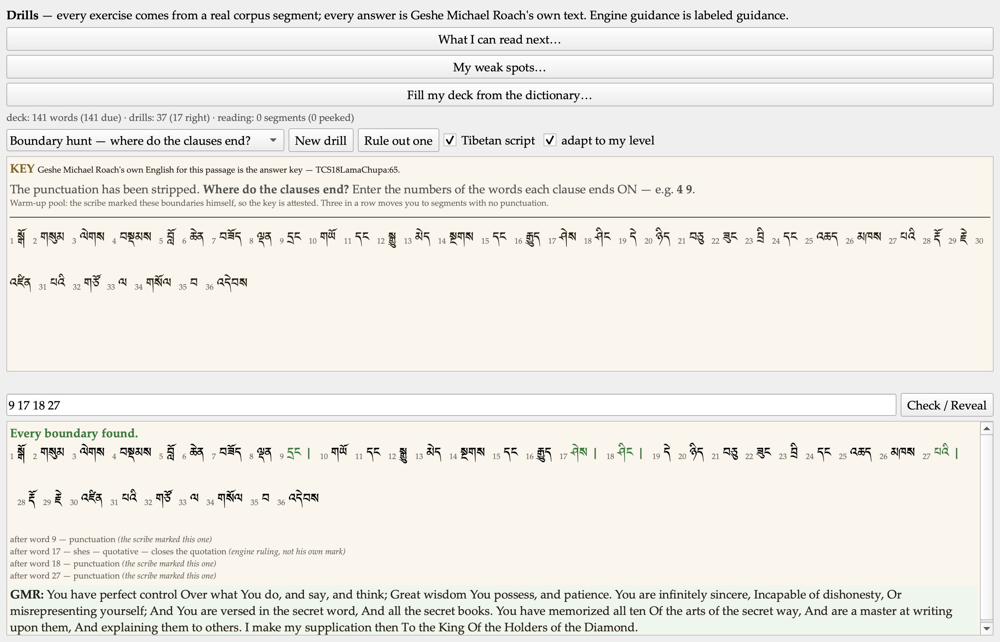
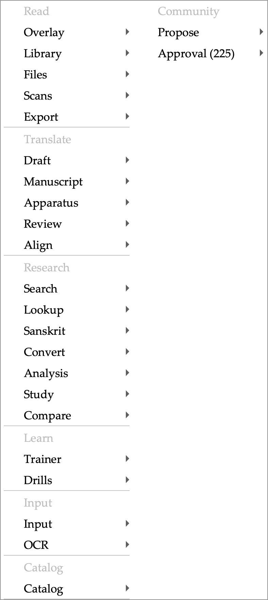

# Diamond Cutter Translation Tool — daily digest, Friday 11 September 2026

**Headline.** The learning half of the tool is finished. Twelve exercises were planned for it; all twelve now work, on my laptop and on my phone. One of them, though, is why I am writing this headline the way I am: the plan had already recorded it as built, and it was not. It did not exist. I found that by going back through the plan and checking its claims against the program rather than against my memory of the day I wrote them, and I would rather report that than a clean twelve.

The second half of the day was the menu bar. It had grown to nineteen drop-down menus, which is roughly twice what a Mac application should have. It is eleven now.

Everything is tested. 115 automated suites green, the self-check at zero failures.

## What I did

### The last three exercises

**Peel** takes a span of Tibetan and asks how many pieces it breaks into at the next level down — not what it means, how it *divides*. That is a reading skill rather than a vocabulary test, and it is the one I most wanted for myself. It runs on 39,945 measured nestings drawn from the word-level alignment of my courses.

**The Debate Dojo** shows a formal debate statement and asks which of its three elements the reply is attacking. It works because the replies are a closed set fixed by the tradition rather than invented here: 1,099 segments in the corpus carry the full template, and 1,089 of those split cleanly into all three parts.

**Boundary Hunt** takes a real segment, strips its punctuation, and asks where the clauses end.

### The entry that said it was built

Boundary Hunt is the one the plan had already marked finished. It was not built. Nothing in the program produced such an exercise and the drills list had no such entry; the mark seems to have been made on the strength of a different exercise that reorders chunks *inside* a clause and never asks where a clause ends.

I have left the false mark in the plan with a note beside it rather than quietly correcting it, because a plan that marks itself complete is worth less than one that can be checked.

Building it properly turned up something better. The plan said our clause-splitter "declines where it cannot rule" on the ambiguous particle *na* — which reads as if the tool knows when to keep quiet. It does not decline. It *splits* when the word before *na* carries real evidence of being a verb, and it *merges* when that evidence is absent — and the absence of evidence is not the same as knowing the word is a noun. So the exercise now reports those positions and does not count them against you, because we do not know that you are wrong.

The same care runs through the rest of it. Where the scribe himself marked a boundary with a shad, the answer key is attested and the exercise says so. Where he did not, the key is the engine's ruling, and every line of the reveal says *that*. The two are kept as separate scores, because progress on the easy pool standing in for progress on the hard one is exactly the kind of flattery this tool exists not to offer.

### A drill you could not answer

While building it I found that the **Mixed set** — the mode that deliberately does not tell you what kind of question is coming — hid its own answer box. Whether the box appeared was decided by the mode selector, which in a mixed set is *supposed* to say only "Mixed set" and never name the kind. So when the queue reached a chunk-order question, there was nowhere to type, and checking scored the empty answer as wrong. One question in four was unanswerable, on a mode that had shipped that same morning.

### On my phone

The phone had one kind of exercise this morning where my laptop had eleven. It now has eleven of its own, and the trainer there gained the key badge and the reading-order question.

**One thing I deliberately did not put on the phone.** "What you can read next" measures my vocabulary against each work's full word list — 66 works, 153,177 glossed headwords — to say what each text will cost me to read. On the laptop that vocabulary grows from reading, from revealing words in the trainer, and from the concordance. The phone has none of those; its vocabulary can only ever grow over what ships inside the exercise pack. Putting the shelf there would divide a real denominator by a numerator capped at a few hundred words and tell me that every text in the library is a fraction of one percent readable. That is not a smaller version of the feature. It is a false number wearing its clothes, and it stays off the phone until the phone has a way to earn the number honestly.

### Nineteen menus, now eleven

I looked at the row of drop-down menus along the top and there were nineteen of them. Twelve I had written, and one more generated automatically for every group of panes — so the bar grew a menu every time the tool grew a group.

Selection moved into Edit, where everything it does already belongs. Project moved into File — a dossier is opened, listed among recents, saved and closed, which is File's whole vocabulary. And every pane group folded into a single **Panes** menu, with each group's name kept as a heading inside it rather than becoming another level to hover through.

The risk here was known before I touched it, and it was real: the buttons I pin to the Quick Access strip are remembered by their position in the menus, and that lookup only ever searched three levels deep. After the regrouping, 135 of the tool's 510 commands sit deeper than three — every pin pointing at one of those would have gone dead. The lookup now walks the whole bar, and a pin left stale by the move is repointed **only when its command name matches exactly one command in the new layout**. If it matches two, or none, the pin is left saying "not in this build" — a pin that quietly starts running a *different* command is worse than one that admits it is broken.

## Decisions I made along the way

- **Record the false "built" mark rather than correct it.** The plan now carries the claim, the fact, and how it was found.
- **Keep the two boundary pools as separate scores.** Merging them would let the easy pool flatter the hard one.
- **Do not put the reading shelf on the phone.** Explained above; it stays until the number can be earned there.
- **Group headings inside Panes, not submenus.** A submenu per group would have put every pane command four levels down and added a hover-and-wait to reaching any of them.
- **Never silently repoint a pin.** One unambiguous match or nothing.

## Numbers

| | |
|---|---|
| Exercises planned for the learning tab | 12 |
| Built and tested | **12** |
| Available on my phone | **11** (the twelfth is explained above) |
| Drop-down menus before / after | 19 / **11** |
| Commands in the menus | 510, of which 135 sit deeper than three levels |
| Measured nestings behind Peel | **39,945** |
| Debate statements carrying the full template | **1,099** (1,089 split into all three parts) |
| Exercises carried in the phone's pack | 8,794 across ten kinds, plus 1,000 trainer passages |
| Automated suites green | **115** |

## Open questions for leadership

- **TestFlight.** The developer programme is paid and active and the app is signed and running on my phone. Nothing has been uploaded yet. I would like to know who besides me should have it on their phone before I put a build there.
- **The recordings.** We hold about three thousand recordings of spoken Tibetan syllables, used in-house with permission. They are deliberately excluded from anything we distribute. If we ever want them in a release, that is a conversation to have with the people who recorded them, not a technical decision.

## Next

- Speak the highlighted Tibetan aloud — the matching engine is built and tested, and nothing plays yet.
- The reading practice from the Kawachen site, rebuilt to work offline inside the tool.
- A spoken-Tibetan trainer, eventually, alongside the classical one.
