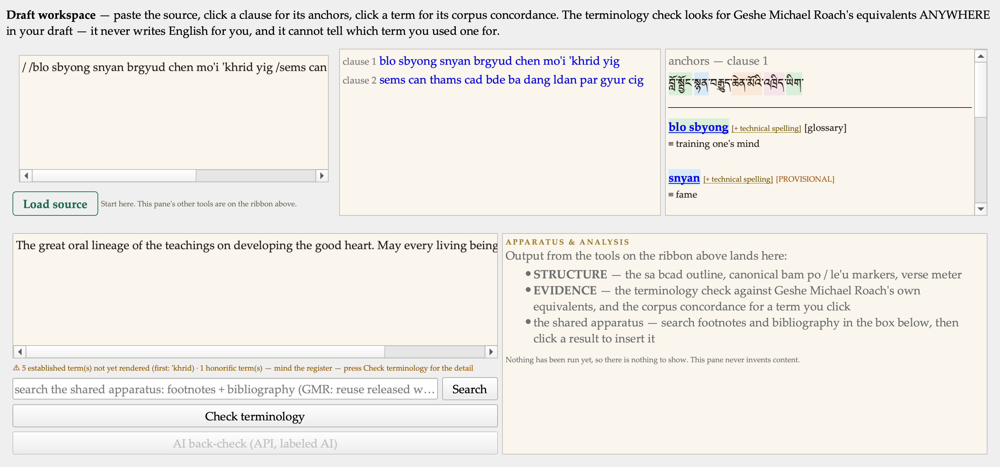

# Diamond Cutter Translation Tool Daily Digest #5 — Saturday, September 12 2026

**Headline.** I spent the day auditing a single screen — the Draft workspace, where a translator actually works — and found sixty defects in it. Almost none were crashes. They were the tool saying more than it knew: a check reporting a clean result over nothing at all, a control that had worked but looked broken, an answer about a text nobody had pasted.

Then I did the thing that made the day worth reporting. I went back and checked my own repairs against the code instead of against my notes, and **seven of the thirty I had marked fixed were not fixed**. I had edited code near them and counted it. That is the whole lesson of the day, and it is a better one than the sixty.

Everything is tested. 115 automated suites green, the self-check at zero failures.

## What I did

### The audit

It started with a screenshot. I opened the Draft workspace with a source loaded and two of the four panels were simply blank. It made no sense, so rather than patch the two panels I had a full audit done of the screen.

**The two blanks were real, and neither was a rendering problem.** The Evidence Ribbon carried its own instructions — and loading a source erased them. So the panel explained itself right up until the moment I followed step one, and then went silent. The bottom-right panel had never been given any content at all: it is shared by several tools, which is exactly why it has to say so. An unlabelled shared output box cannot be read.

The audit then explained something I had not asked about — junk text sitting in my own draft. The guard meant to stop empty bibliography entries tested for a string the composer cannot produce, so it never fired, and every accept had been pasting scaffolding into the draft under a banner claiming it conformed to our published house format.

### What the audit was really about

Sixty findings, and a pattern behind them: **a control that cannot act failing to say why before it is pressed, rather than after.** And its sibling: a result reported over nothing.

- "Check terminology" with no source loaded printed "0 terms · 0 without an equivalent" — a tally that reads as *my draft is clean*.
- Four structural tools answered confidently about an empty box: "no sa bcad markers found in this text", "no dominant meter". Each of those is a finding about a text, and there was no text.
- Five insertions landed wherever the draft's cursor last sat, often off-screen, then the dialog closed — so a control that had worked looked broken.

### The one that mattered most

It was not in the sixty. I tested the terminology matcher rather than reading it:

> "mind" found in "he **remind**ed them of the vow" — MATCH
> "art" found in "a dep**art**ure from the path" — MATCH
> "one" found in "he was h**one**st about it" — MATCH

A plain substring search sat underneath the pane's headline verdict. Every one of those reported a term as **rendered** when the equivalent never appears as a word at all. A translator reading "12 of 14 terms matched" was being told something false about their own draft — and in the direction that flatters it.

### Where the tool was overstating you

Three places, all fixed, all the same class:

- **Your published English was being cut mid-sentence** in seven places with no ellipsis and no mark. On a tool whose whole claim is that the English on screen is yours, an invisible cut is the wrong silence.
- **"The master has translated this clause"** appeared over what was only a containment hit — the clause appears *inside* a larger segment, and what followed was that whole segment's English. It now says "this clause appears in the corpus" and, where the clause is a small part of the segment, says what percentage.
- **The AI back-check claimed the model's citations were engine-verified.** They are not. The engine gives the model verified anchors; nothing checks what it writes back.

### The suite was editing your own work

Eight separate findings, none of them in the pane's logic. The test battery had been writing into my real data: six phantom document records in the library, one carrying **revision 410** — four hundred and ten runs of accumulated history for a document nobody ever wrote. It reset my scroll position and cursor in the reading pane, put temp files in my recent-files list, and switched my Features choices back on.

### Renaming a draft lost its history

Or appeared to. The version history is keyed differently from the properties record, so renaming or moving a draft left the history behind and the Versions window announced "No versions yet" over work still sitting on disk. Three panes needed the same fix and one of them — the Manuscript — had been missed entirely.

The Versions window itself was the subtler half: a version record deliberately keeps the path the file had **when it was saved**, because that is provenance and rewriting it would falsify the record. The fix was not to rewrite history but to make the window say what is true — *these versions exist, recorded under the file's former path, nothing has been lost.*

### Then I checked my own work

Thirty findings I had marked closed, checked against the code rather than my notes. **Seven were not closed.** One I had never touched at all — I had fixed a different widget in a different column and counted it. Two of the fixes were inert: one was undone by the toolkit a moment after I applied it, which was proved by building a small probe rather than by reasoning. One guard was present but sat on a path where it had already been switched off — proved from my own settings file, which still held the probe folder written *after* the fix.

## Decisions I made along the way

- **Do not rewrite a version's recorded path.** It is provenance. Fix the viewer instead.
- **Do not re-key the properties record yet.** It would have started losing properties on every Move until all three panes carried history — and one did not. The reasoning is written down for whoever picks it up.
- **Leave the false marks visible.** Where a document claimed something untrue, I corrected it with a note beside it rather than quietly editing it. A plan that marks itself complete is worth less than one that can be checked.
- **Withhold rather than guess.** An engine-generated pronunciation no longer goes into a publishable draft unmarked; the tool says which reading it withheld and why.

## Numbers

- Defects found in one screen: **60** — 18 serious, 31 moderate, 11 minor
- My own repairs re-checked against the code: **30**
- …of those, confirmed genuinely fixed: **23**
- …of those, **not** actually fixed despite my having said so: **7**
- Deliberately not fixed, with the reason written down: **3**
- Repaired but not yet independently re-checked: the remainder — and after
  today I am not going to quote that as a number of successes
- Phantom document records removed from my library: **6** (one at revision 410)
- Automated suites green: **115**

## Open questions for leadership

- **TestFlight.** Unchanged from yesterday: the programme is paid, the app is signed and running on my phone, nothing is uploaded. I would like to know who should have it before I put a build there.
- **A second reader.** Today's most valuable hour was spent checking my own work and finding it wanting. That argues for someone other than me reading this code before release, and I would like to know who that could be.

## Next

- Finish the seven, then the eleven minor findings.
- Audit the remaining panes the same way. If one screen held sixty, the others are not clean.
- The reading practice from the Kawachen site, rebuilt to work offline.
