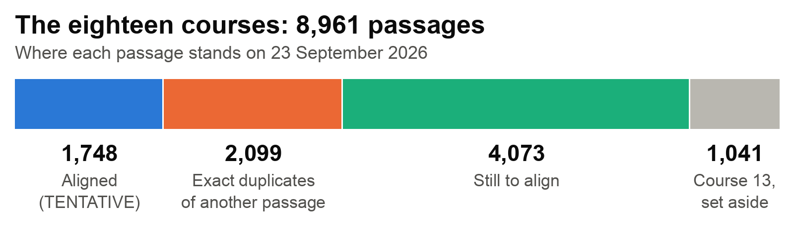

# Diamond Cutter Translation Tool Daily Digest #10 — Wednesday, September 23 2026

*Covers the work since digest #9: Thursday afternoon into Friday morning,
Tuesday, and today. There was no work over the weekend or on Monday.*

**Headline.** The word-by-word alignment of Course 5 has more than doubled, to
366 of its 511 passages, and the alignment now holds 50,370 links — all still
TENTATIVE, matched by machine and not yet checked by a person.

## What I did

### Course 5: from 180 to 366 of 511

Course 5 passed its halfway mark and reached passage 366, adding 62 pages and
about eight thousand links. Every link is labelled **TENTATIVE**. The checks
prove that each quotation of Geshe Michael's English is exact; they cannot
prove that each pairing is right.

The most valuable work was in what the alignment refused to link: links that
would have passed every automatic check and still been false. In one passage,
the Tibetan "because" half of a "because… therefore" pair would have been
linked to Geshe Michael's "for this very reason", which belongs to the other
half, so the link would have pointed the wrong way.

I paused the alignment on Tuesday and wrote down exactly where it stopped. The
prepared work for passages 367 and 368, and a failed first attempt at 369, sat
in a temporary area that is wiped on restart, and it is gone. None of it had
been added to the alignment, so nothing already there is affected, but all
three must be done again from the start.

### Forty-four new entries in the defect register, one of them serious

Aligning this closely turns up faults in the source documents themselves.
There are 44 new entries on record, all in Course 5: 22 rated confirmed, the
rest probable or uncertain, and none yet checked by a person. The most serious
is at passage 324: the English reads "virtue of the formless realm", but the
Tibetan there speaks of the realm of *form*, and the Tibetan word for
"formless" appears nowhere in the passage.

Two defects reach into Geshe Michael's dictionary itself. A keying error,
*ma byin lan* for *ma byin len*, "taking what is not given", has its own
dictionary entry, and the only places that entry records it occurring are one
line of Course 5 and a copy of that line — so a check against the dictionary
seems to confirm the misspelling. And a misprinted phrase, "less that what
they really", has been gathered into the dictionary as one of Geshe Michael's
equivalents for *skur ba*. Neither is ours to change: the program imports the
dictionary rather than owning it.

### The alignment ahead is about 4,100 passages

I had been sizing the remaining work against every passage we hold, about
42,000. The standing instruction is the eighteen courses. Taking out Course 13
(set aside because stretches of its English sit beside the wrong Tibetan), the
passages already aligned, and the passages that are word-for-word copies of
another, about 4,100 remain to be aligned in the eighteen courses.

### Rows beside the wrong English: one more course, and probably a second

Tibetan sitting one row off from its English is the fault that set Course 13
aside, and we had believed it could not be detected automatically. A trial
check, not yet one of the project's own checks, can now detect it. It found
Course 13's recorded stretch with exact boundaries. It also found a second,
unrecorded stretch in Course 13, which Course 18 repeats word for word — so
Course 18 carries the same fault. There the offset is plain to see: the
English "It is a changing thing," stands beside the Tibetan of the line before,
and each English line sits one row above the Tibetan it translates.

A second trial check flagged probable stretches elsewhere in Course 18 and in
Course 15 that nobody has read yet. Both checks raise false alarms, and the
first misses short runs, so nothing they flag is decided until it has been
read. 237 rows in three stretches are held back: the tool that adds pages to
the alignment now refuses them, and the copying tool will get the same rule
before it is ever used. Nothing in those rows was edited.

### Fixes to what the program shows

- The word *gus*, which I reported last time as showing as "i", now leads with
  its right meaning everywhere the desktop program shows a meaning. The
  dictionary still lists "i" first; the program now puts it last, and nothing
  was deleted.
- In eight places on screen and 51 lines of the help pages, the program used a
  pronoun where Geshe Michael should be named; all now use the name. The
  three-part handout of the user manual, which had been describing a smaller
  program since August, is now generated from the current manual.
- A warning label that tells a translator a text is *not* Geshe Michael's
  approved English was printed in pale amber at about three-fifths of the
  contrast the accessibility standard requires. It and 143 other faint texts
  are now readable.

Apart from the *gus* fix, these reach the installed program with its next
build.

### One fault on screen that is not fixed yet

A card in the program headed "Geshe Michael teaches this idea" points to
moments in recorded classes. The list behind it never checks who is speaking,
and by one measurement about two in five of those moments come from
recordings titled for other teachers. Until it is fixed, the heading claims
more than the program knows. The first step is to make it say the speaker has
not been checked.

### The project's own checks

A machine audit of twelve of the project's automatic checks, with every
serious claim challenged by a second, independent machine pass, found
seventeen serious faults in the checks themselves. Thirteen are fixed, each
proved by deliberately breaking what it guards and watching the check fail;
four remain open. There are now 134 checks, up from 125, and all 134 pass.

### Two things I got wrong

- For about two hours today, a deliberately broken test copy of the tool that
  builds the alignment's pages was saved into the project's record by mistake.
  It was caught on review and taken out. No page was built with it, and it
  never reached the installed program.
- Earlier digests counted every entry in the defect register as a defect in
  the source documents. Some entries are slips in our own work, some were
  checked and found not to be errors, and one could not be verified. Counted
  properly, the figure at the last digest was 221, not 254.

## Decisions I made along the way

- **Who counts as a human check.** Only Geshe Michael, or one of the main
  Diamond Cutter Classics translators, can mark this work as checked by a
  person. No link in the alignment has been checked by a person yet.
- **Rows the new checks flag as possibly beside the wrong English stay out**
  until I have read them.
- **Four new requests, filed and not yet started:** a guide to translating
  titles (ornamental or descriptive, and which comes first); a read-along of
  Geshe Michael's translations where hovering on a Tibetan word shows its
  English (the word-by-word links it needs exist today for about 4% of the
  paired passages); an estimator from Tibetan folios to English pages, which
  will have to give a range; and a way to bring in the Himalayan Art Resources
  site, which has to begin by asking their permission.

## Numbers

| | Now | At digest #9 |
|---|---|---|
| Course 5 alignment | 366 of 511 passages | 180 |
| Attested alignment links banked | 50,370 | 42,345 |
| Source-document defects on record | 265 | 221 (reported then as 254) |
| New entries since the last digest | 44 (22 confirmed, one serious) | — |
| Rows held back until read | 237 | — |
| Passages of the eighteen courses still to align | 4,073 | — |
| Links checked by a person | 0 | 0 |
| Automatic checks, all passing | 134 | 125 |
| Geshe Michael's dictionary and the course texts changed | **none** | |

## Open questions for leadership

- **A first human check.** When the alignment is ready for it, would Geshe
  Michael, and the translators I will name, each judge the same thirty
  randomly chosen links — a Tibetan word or phrase and the English matched to
  it — blind, without seeing the machine's answer first? It is the only way to
  turn "the machine agrees with itself" into a real accuracy figure.
- **Who applies the dictionary corrections, and when.** The work order in my
  correction to the last digest — 627 spellings that can be corrected
  mechanically and 755 that need a reader — is ready, and the two dictionary
  defects described above are now on it. The corrections have to be made by whoever
  produces the next dictionary release; until then the wrong spellings stay on
  screen.
- **Still open from the last digest:** the grammar questions in the decision
  brief, chiefly whether to model the Tibetan account of letter gender; when
  Geshe Michael teaches grammar, are the small connecting words called
  "particles"; whether someone with Sanskrit could settle how one letter
  cluster should be written, or whether Geshe Michael would rule on it; and
  what "all of Geshe Michael's translations" includes — the 42,199 paired
  passages we hold are only part of it, and only the organisation's records
  can say what is missing.

## Next

- Make the working area permanent, so prepared work cannot vanish again; then
  redo Course 5 passages 367 to 369 and continue.
- Fix the "Geshe Michael teaches this idea" card.
- Read the 237 held rows.
- Once its remaining faults are fixed, try on one batch a way of recording each
  link by its position in the course text instead of copying out the words, so
  that a misquotation becomes impossible.
